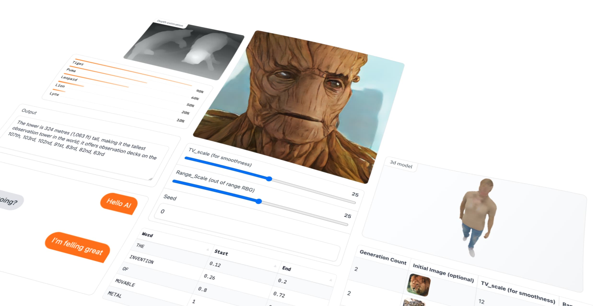

<p align="center">
  <a href="https://gradio.app"></a> 
</p>
<p align="center">
    <em>Build & share delightful machine learning apps easily</em>
<p align="center">
<a href="https://circleci.com/gh/gradio-app/gradio" target="_blank">
    
</a>
<a href="https://badge.fury.io/py/gradio" target="_blank">
    
</a>
<a href="https://codecov.io/gh/gradio-app/gradio/branch/master/graph/badge.svg?token=NNVPX9KEGS" target="_blank">
    
</a>
<a href="https://pypi.org/project/gradio/" target="_blank">
    
</a>
<a href="https://twitter.com/gradio " target="_blank">
    
</a>
</p>

# Gradio: Build Machine Learning Web Apps — in Python

Gradio is an open-source Python library that is used to build machine learning and data science demos and web applications.

With Gradio, you can quickly create a beautiful user interface around your machine learning models or data science workflow and let people "try it out" by dragging-and-dropping in their own images,
pasting text, recording their own voice, and interacting with your demo, all through the browser.



Gradio is useful for:

* **Demoing** your machine learning models for clients / collaborators / users / students

* **Deploying** your models quickly with automatic shareable links and getting feedback on model performance

* **Debugging** your model interactively during development using built-in manipulation and interpretation tools

**You can find an interactive version of the following Getting Started at [https://gradio.app/getting_started](https://gradio.app/getting_started).**

$getting_started

## System Requirements:

- Python 3.7+

## Open Source Stack

Gradio is built with many wonderful open-source libraries, please support them as well!
<p>
<a href="https://hf.co/"></a>
<a href="https://www.python.org/"></a>
<a href="https://fastapi.tiangolo.com/"></a>
<a href="https://github.com/encode/"></a>
<a href="https://svelte.dev"></a>
<a href="https://vitejs.dev/"></a>
<a href="https://pnpm.io/"></a>
<a href="https://tailwindcss.com/"></a>
</p>

## License:

Gradio is licensed under the Apache License 2.0

## See more:

You can find many more examples as well as more info on usage on our website: https://gradio.app

See, also, the accompanying paper: ["Gradio: Hassle-Free Sharing and Testing of ML Models in the Wild"](https://arxiv.org/pdf/1906.02569.pdf), *ICML HILL 2019*, and please use the citation below.

```
@article{abid2019gradio,
title={Gradio: Hassle-Free Sharing and Testing of ML Models in the Wild},
author={Abid, Abubakar and Abdalla, Ali and Abid, Ali and Khan, Dawood and Alfozan, Abdulrahman and Zou, James},
journal={arXiv preprint arXiv:1906.02569},
year={2019}
}
```
